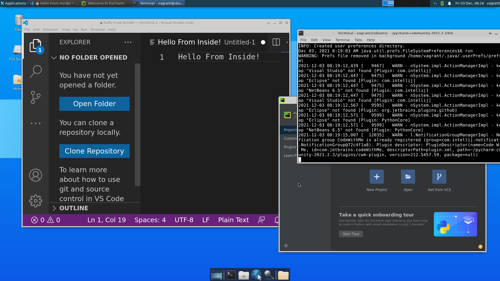

# Docker Based Linux Desktop Experience
VM-like experience backed by Docker and Vagrant with full Desktop GUI and common applications (VS Code, git, etc) pre-installed.



# Common issues
In the Vagrantfile, there are two options:
'-v', '/etc/vulkan/icd.d/nvidia_icd.json:/etc/vulkan/icd.d/nvidia_icd.json', 
'-v', '/etc/vulkan/implicit_layer.d/nvidia_layers.json:/etc/vulkan/implicit_layer.d/nvidia_layers.json',

- make sure to check "nvidia_icd.json" and "nvidia_layers.json"'s location on the host machine
- this code base only tested with ubuntu 20.04 and Nvdia driver "525.60.11" . Other versions of nvidia driver might cause issues. Other versions of ubuntu might be working but need some tweaking. We highly recommend using the recomended driver version, as we are not able to get the code to work with certain versions of nvidia driver.

## Why Use It
- Lightweight - Backed by Docker
    - Enjoy all benefits of Docker
- Instant Spin Up/Destroy VMs
- Cross Platform
    - Windows (not tested)
    - Linux
- Highly Customizable
- Docker-IN-Docker preconfigured
    - You can use Docker right out of the box inside the VM

## Pre-Installed Applications in VM
Below is the list of pre-installed applications. You may easily customize as needed by modifying `Dockerfile`!

1. VS Code
2. Python3
3. Git
4. Docker
5. ... and some others

## Requirements
### Linux
Only Ubuntu 20.04 has been tested. 
- Docker
- Vagrant
- freerdp2-x11

```sh
$ sudo apt update
$ sudo apt install -y docker.io vagrant freerdp2-x11
```

## Quick Start
All the `vagrant` commands below are run in the host.
1. Create a folder for you VM to use. Each VM should have its own folder.
2. Copy the `Vagrantfile` into the folder you created.
3. In the folder, run `vagrant up` to spin up the VM.
4. Run `vagrant ssh` to get an ssh shell into the VM. Or run `vagrant rdp -- '-f'` to use GUI.
    - If asked, the username and password are both `vagrant`.

## Useful Commands
- `vagrant up`
    - Spins up the VM if not already
        - Behind the scene it's `docker run ...`.
    - If already spun up, then this boots up the VM instead
        - Behind the scene it's `docker start ...`.
- `vagrant halt`
    - Shutdown the VM.
        - Behind the scene it's `docker stop ...`.
- `vagrant destroy`
    - Destroys the VM.
        - Behind the scene it's `docker rm -f ...`.
- `vagrant ssh`
    - Get an ssh connection into the VM
- `vagrant rdp -- '-f'`
    - Get an RDP connection (GUI) into the VM
    - `'-f'` for fullscreen

## FAQ
### I get some network error when running `vagrant up`
After running `vagrant up` to spin up the VM, you may see the following error:
```
A Docker command executed by Vagrant didn't complete successfully!
The command run along with the output from the command is shown
below.
 
Command: ["docker", "network", "connect", "vagrant_network", "6938a279a0e2a1a8193d10e773ffd6e810e675fe0ec467b3f0ca954907a8f330", {:notify=>[:stdout, :stderr]}]
 
Stderr: Error response from daemon: failed to add interface veth7b11df7 to sandbox: error setting interface "veth7b11df7" IP to 172.18.0.2/16: cannot program address 172.18.0.2/16 in sandbox interface because it conflicts with existing route {Ifindex: 4 Dst: 172.18.0.0/16 Src: 172.18.0.1 Gw: <nil> Flags: [] Table: 254}
```

In this case, please run a `vagrant destroy` and then followed by another `vagrant up`. This should solve the problem.

### How to share files between Host and VM
The VM-folder in the host (i.e. the folder where you created to place the `Vagrantfile`) is volume-binded to the VM's `/vagrant/` folder.

In the VM, you can copy files into `/vagrant/` folder, and the same files will show up in the host's VM-folder, and vice-versa.

### I need to open up some ports in the VM so that the host can access them
You may be running a Flask server inside the VM, and you want the host (or even another computer on the public Internet) to have access to the Flask server.

By default, five user ports (11111-11115) in the VM have been exposed. When you spins up the VM, Vagrant does something like `docker run -p 11111-11115:11111-11115 ...` for you. 

Usually the host can access these ports by, for example, `localhost:11111` or `<host_ip>:11111`.

However, to avoid port collision on the host (for example, another application on the host may be already using port 11111), Vagrant might alter the port mapping. To view the actual port mapping, you need to run `docker ps` to see which host port is mapped to which VM port.

For example, the below shell snippet shows that the `tempvm` has port 11112 mapped to the host port 2202.
```
PS C:\Users\plum\tempvm> docker ps
CONTAINER ID   IMAGE                COMMAND                  CREATED         STATUS         PORTS

          NAMES
1c4d7f1c9735   erdnase/vm:generic   "/bin/sh -c 'service…"   2 minutes ago   Up 2 minutes   1-21/tcp, 23-3388/tcp, 3390-11110/tcp, 11116-65535/tcp, 127.0.0.1:2206->22/tcp, 0.0.0.0:2200->3389/tcp, 0.0.0.0:2201->11111/tcp, 0.0.0.0:2202->11112/tcp, 0.0.0.0:2203->11113/tcp, 0.0.0.0:2204->11114/tcp, 0.0.0.0:2205->11115/tcp   tempvm_default_1638525110
a2fe8dcb3469   erdnase/vm:generic   "/bin/sh -c 'service…"   2 hours ago     Up 2 hours     1-21/tcp, 23-3388/tcp, 3390-11110/tcp, 11116-65535/tcp, 0.0.0.0:11111-11115->11111-11115/tcp, 127.0.0.1:2222->22/tcp, 0.0.0.0:33890->3389/tcp
          ubuntu-vm_default_1638519316
```

Please try to design your server/application to use one of these five exposed ports.

If you absolutely need more ports or need more port flexibility, you have four options.
1. If you haven't spun up the VM, you may modify the `Vagrantfile` to customize the port mapping to suit you need.
2. If you have already spun up the VM, you may modify the `hostconfig.json` file associated with your VM in the host. See [this link](https://stackoverflow.com/questions/19335444/how-do-i-assign-a-port-mapping-to-an-existing-docker-container) for detail.
3. Use [ngrok](https://ngrok.com/) to expose ports on the fly. An `ngrok` executable has been already placed in the `/home/vagrant` directory in the VM.
4. (for Linux host only) If you host is Linux, you are in luck. Inside VM, execute `ifconfig` and get the VM's `eth0` ip address in the `inet` field. You can use this ip address in the host with any port without any additional setup.

### GUI is behaving strangely
Please strike CTRL key several times. This should solve the problem.

### How to get out of full-screen RDP
- Linux Host
    - Hit CTRL-ALT-ENTER to toggle full screen

### My VM is hosted on a remote server. How do I access the GUI?
Run `docker ps` to see which port on the host is mapped to the 3389 port in the VM. Typically it's 33890.

Open your RDP client, and connect to `<host_ip>:33890` assuming 33890 on the host is mapped to 3389 in the VM.


### Linux OS Host
1. Run `vagrant ssh` to get ssh access to VM.
2. Run any GUI app. For example, `xclock`. You should see an app popping up in the host's Desktop environment.
3. If not working, try running `xhost +` on the host to disable access control. Please fully understand the security implications.
